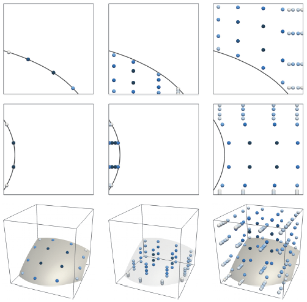

_Algoim_ is a collection of high-order accurate numerical methods and C++ algorithms for working with implicitly defined geometry and level set methods. Motivated by multi-phase multi-physics applications, particularly those with evolving dynamic interfaces, these algorithms target core, fundamental techniques in level set methods. They have been designed with a view to standard finite difference implementations as well as more advanced finite element and discontinuous Galerkin implementations, multi-threading and massively parallel MPI computation. The collection includes:
- High-order accurate quadrature algorithms for implicitly defined domains in hyperrectangles, for example in computing integrals over curved surfaces or domains.
- High-order accurate closest point calculations to implicitly defined surfaces _(Coming soon...)_
- k-d trees optimised for codimension-one point clouds _(Coming soon...)_
- Accurate level set reinitialisation and extension velocity schemes _(Coming soon...)_
- Voronoi implicit interface methods for multi-phase interconnected interface dynamics _(Coming soon...)_

## Prerequisites

Many of the numerical algorithms implemented in Algoim are templated on the spatial dimension `N`, allowing one to develop numerical schemes for any number of spatial dimensions. To assist with this functionality, Algoim makes use of the open source C++ library [blitz++](https://github.com/blitzpp/blitz) for high-performance fixed-length vector arithmetic, through `template<typename T, int N> blitz::TinyVector<T,N>`. Therefore, **[blitz++](https://github.com/blitzpp/blitz) should first be downloaded, configured for your compiler, and installed** such that it can be found in the appropriate include directories, i.e., so that `#include <blitz/array.h>` resolves correctly.

In addition, a C++ compiler supporting standard C++14 or higher is required.

## Download

Clone via

```
git clone https://github.com/algoim/algoim.git
```

or visit the [Algoim GitHub page](https://github.com/algoim/algoim).

## Installation

Algoim is a header-only C++ library. Except for small example/demonstration applications, all of the files are C++ `.hpp` header files. As such, it requires minimal installation effort: simply download and configure so that the appropriate header driver can be found by your compiler when you include it in your C++ program, e.g., `#include "algoim/src/algoim_quad.hpp"`.

## High-Order Quadrature Algorithms for Implicitly Defined Domains

An implicitly defined domain is either a volumetric region or codimension-one surface whose shape is characterised implicitly by an isosurface of a continuous scalar function. A variety of applications involving implicitly defined geometry require the evaluation of integrals over such domains, including level set methods for propagating interfaces in computational physics, embedded boundary methods for solving partial differential equations on curved domains, and in treating jump conditions and singular source terms in weak formulations. A specific example is that of [implicit mesh discontinuous Galerkin methods](https://doi.org/10.1016/j.jcp.2017.04.076), which have been developed to facilitate high-order accurate modelling of interfacial fluid dynamics.

In practice, to calculate integrals over implicitly defined domains, a quadrature scheme must be computed. In [R. I. Saye, _High-Order Quadrature Methods for Implicitly Defined Surfaces and Volumes in Hyperrectangles_, SIAM Journal on Scientific Computing, 37(2), A993-A1019 (2015)](http://dx.doi.org/10.1137/140966290), a general purpose, high-order accurate quadrature algorithm has been developed. Based on the idea of converting the implicitly defined geometry into the graph of an implicitly defined height function, the approach requires only one-dimensional root finding and simple one-dimensional Gaussian quadrature schemes. These algorithms produce quadrature schemes with strictly positive weights and inherits the high-order accuracy of Gaussian quadrature, e.g., with 4 points (per dimension), 8th order accuracy can be achieved. Examples of generated quadrature schemes are shown in the figure.

<div style="width:502px; margin: 0 auto; font-size: 70%"><br/>Some examples illustrating the quadrature schemes constructed by the algorithm (based on a one-dimensional Gaussian quadrature scheme of order 4) for surface integrals (left column) and volume integrals (middle/right columns). The weights are coloured according to a scale that is normalised for each particular case: pale indicates a low-valued weight and dark blue indicates a high-valued weight.</div>

### Citing

If you make use of these quadrature algorithms in your research, in any documentation or publication please cite - in addition to _Algoim_ - the original paper describing these algorithms:
- [R. I. Saye, _High-Order Quadrature Methods for Implicitly Defined Surfaces and Volumes in Hyperrectangles_, SIAM Journal on Scientific Computing, 37(2), A993-A1019 (2015)](http://dx.doi.org/10.1137/140966290)

### Usage

The driver header file for the quadrature algorithms is located at `algoim/src/algoim_quad.hpp`. There is only one driver routine, `quadGen` which is templated on the level set function object `phi` and the dimension `N`:

```cpp
template<int N, typename F>
Algoim::QuadratureRule<N> Algoim::quadGen(const F& phi, const Algoim::BoundingBox<Real,N>& xrange,
                                          int dim, int side, int qo);
```

The provided parameters are as follows:
- `phi` is a user-defined function object which evaluates the level set function and its gradient. It must implement both `template<typename T> operator() (const blitz::TinyVector<T,N>& x) const` and `template<typename T> grad(const blitz::TinyVector<T,N>& x) const`. In the simplest case, `T = double` and the role of `phi` is to simply evaluate the level set function (e.g., `return x(0)*x(0) + x(1)*x(1) - 1;` for a unit circle) and its gradient (e.g., `return blitz::TinyVector<double,2>(2.0*x(0), 2.0*x(1));`). However, it is crucial that these two member functions be templated on `T` in order to enable the interval arithmetic underlying the algorithms of the paper cited above. In essence, the interval arithmetic automatically computes a first-order Taylor series (with bounded remainder) of the given level set function, and uses that to make decisions concerning the existence of the interface and what direction to use when converting the implicitly defined geometry into the graph of an implicitly defined height function. This requirement on `phi` being able to correctly perform interval arithmetic places restrictions on the type of level set functions `quadGen` can be applied to; these restrictions are discussed later.
- `xrange` is a user-specified bounding box, indicating the extent of the hyperrectangle in `N` dimensions to which the quadrature algorithm is applied.
- `dim` is used to specify the type of quadrature:
    - If `dim < 0`, compute a **volumetric quadrature scheme**, whose domain is implicitly defined by `{phi < 0}` intersected with `xrange`.
    - If `dim == N`, compute a **curved surface quadrature scheme**, whose domain is implicitly defined by `{phi = 0}` intersected with `xrange`.
    - If `0 <= dim && dim < N`, compute a **flat surface quadrature scheme** for one of the sides of the hyperrectangle, i.e., for the domain `{phi < 0}`, intersected with `xrange`, intersected with the flat face `{x(dim) == xrange(side)(dim)}`.
- `side` is used only when `0 <= dim && dim < N` and specifies which side of the hyperrectangle to restrict to, either `side == 0` or `side == 1` for the "left" or "right" face, respectively (with normal pointing in the direction of the `dim`-th axis).
- `qo` specifies the degree of the underlying one-dimensional Gaussian quadrature scheme and must satisfy `1 <= qo && qo <= 10`. For example, `qo = 4` in the figure above.

The output of `quadGen` is an `Algoim::QuadratureRule<N>` object. This object is essentially a `std::vector` listing the set of quadrature points (as `blitz::TinyVector<Real,N>`) and their corresponding weights. A `QuadratureRule` object is also a functor -- its associated templated member function `operator()(const F& f)` can be applied to any user-specified integrand function to compute the result of applying the quadrature rule to a functional.

**Requirements on `phi`.** As mentioned above, the `phi` functor must be able to accept arguments of type `blitz::TinyVector<Algoim::Interval<N>,N>`. Here, `Algoim::Interval<N>` is a special type whose purpose is to calculate a first-order Taylor series with bounded remainder, and shares concepts in common with automatic differentiation (see the paper cited above for more details). `Interval<N>` implements `operator+`, `operator*`, `operator/`, etc., and can be used in a variety of ways, most commonly in evaluating polynomial expressions. Common unary operators are also implemented, e.g., `sin(Interval<N>)` and `exp(Interval<N>)`. However, one cannot straightforwardly apply `Interval<N>` arithmetic to max or min statements, if conditions, and other non-standard or non-smooth functions. This relates to the fact that it is very difficult and subtle to compute quadrature schemes for shapes which have corners, holes, or cusps, etc. In using Algoim quadrature schemes for the first time, it is recommended they be applied to smooth level set functions made out of polynomial expressions and common smooth functions like `sin`, `exp`, etc.

### Examples

**All of these examples are implemented in `algoim/examples/examples_quad.cpp` in a single `main()` entry point; compile them with a C++14 compatible compiler of your choice.**

The quadrature algorithms of Algoim are here demonstrated with a level set function describing an ellipse (in `N = 2` dimensions) or ellipsoid (in `N = 3` dimensions). First, we define a function object implementing the level set function:

```cpp
template<int N>
struct Ellipsoid
{
    template<typename T>
    T operator() (const blitz::TinyVector<T,N>& x) const
    {
        if (N == 2)
            return x(0)*x(0) + 4.0*x(1)*x(1) - 1.0;
        else
            return x(0)*x(0) + 4.0*x(1)*x(1) + 9.0*x(2)*x(2) - 1.0;
    }

    template<typename T>
    blitz::TinyVector<T,N> grad(const blitz::TinyVector<T,N>& x) const
    {
        if (N == 2)
            return blitz::TinyVector<T,N>(2.0*x(0), 8.0*x(1));
        else
            return blitz::TinyVector<T,N>(2.0*x(0), 8.0*x(1), 18.0*x(2));
    }
};
```

To compute the area of the ellipse in 2D using a scheme with `qo = 4`, apply `quadGen` to a bounding box encapsulating the extent of the ellipse, and then apply the resulting quadrature rule to the integrand _f(x) = 1_:

```cpp
Ellipsoid<2> phi;
auto q = Algoim::quadGen<2>(phi, Algoim::BoundingBox<double,2>(-1.1, 1.1), -1, -1, 4);
double area = q([](const auto& x) { return 1.0; });
// area ≈ 1.5708
```

To compute the volume of the ellipsoid in 3D, it is as simple as changing `N`:

```cpp
Ellipsoid<3> phi;
auto q = Algoim::quadGen<3>(phi, Algoim::BoundingBox<double,3>(-1.1, 1.1), -1, -1, 4);
double volume = q([](const auto& x) { return 1.0; });
// volume ≈ 0.69813
```

Each of the two examples above relied on the quadrature scheme's ability to automatically subdivide the given bounding box until the interface geometry can be represented as the graph of a well-defined height function. The subdivision routine terminates as soon as an internal criterion is met (discussed more in the paper cited above). An alternative method revealing asymptotic high-order accuracy is to subdivide the ellipsoid via a Cartesian grid and apply `quadGen` to individual grid cells, as follows:

```cpp
int n = 16;
double dx = 2.2 / n;
Ellipsoid<2> phi;
double area = 0.0;
for (int i = 0; i < n; ++i) for (int j = 0; j < n; ++j)
{
    blitz::TinyVector<double,2> xmin = {-1.1 + i*dx, -1.1 + j*dx};
    blitz::TinyVector<double,2> xmax = {-1.1 + i*dx + dx, -1.1 + j*dx + dx};
    area += Algoim::quadGen<2>(phi, Algoim::BoundingBox<double,2>(xmin, xmax), -1, -1, 4).sumWeights();
}
// area ≈ 1.570796327
```

To compute the measure of an implicitly defined codimension-one surface, change the `dim` parameter to equal `N`:

```cpp
Ellipsoid<3> phi;
auto q = Algoim::quadGen<3>(phi, Algoim::BoundingBox<double,3>(-1.1, 1.1), 3, -1, 4);
double surface_area = q.sumWeights();
// surface_area ≈ 4.4007
```

To visualise a quadrature scheme produced by `Algoim::quadGen`, a tool is provided in `algoim/src/algoim_quad.hpp` which outputs a scheme in the format of an XML VTK `.vtp` file, which one can visualise, e.g., with [ParaView](https://www.paraview.org/). The routine takes as input a user-defined stream, e.g., a `std::ofstream`, and writes XML to the stream, interpreting the quadrature scheme as a scattered set of points with associated weights:

```cpp
#include <iostream>
...
Algoim::QuadratureRule<N> q = ...;
std::ofstream f("scheme.vtp");
Algoim::outputQuadratureRuleAsVtpXML(q, f);
// Open scheme.vtp in ParaView
```

More examples of using Algoim's quadrature code will be added in the future or as requested.

## Advanced: Double-Double and Quadruple-Double Precision

_Algoim_ is by default configured to use `double` precision arithmetic (`Algoim::Real` is a typedef for `double`). For very high precision applications of the associated high-order accurate algorithms, Algoim can interface to the open-source [QD library](http://crd-legacy.lbl.gov/~dhbailey/mpdist/) which implements software-driven double-double and quadruple-double precision arithmetic. To enable this feature:

1. Download and install [QD](http://crd-legacy.lbl.gov/~dhbailey/mpdist/) so that your compiler can resolve the necessary includes, e.g., `#include <qd/dd_real.h>` (FIX THIS)
2. When compiling Algoim-related code, use your compiler to define a global-scope preprocessor directive as follows:
    - To use double-double precision, define `ALGOIM_DDREAL`. For example, for GCC or ICC, use the compiler argument `-DALGOIMDD_REAL`.
    - To use quadruple-double precision, define `ALGOIM_QDREAL`.

When either of the above preprocessor directives are enabled, `Algoim::Real` becomes a typedef for `dd_real` or `qd_real`. This also affects other internal workings of Algoim, for example, the precomputed Gaussian quadrature schemes in `algoim/src/algoim_gaussquad.hpp` are replaced with _QD_-compatible constants having over 64 digits of accuracy.

## About

_Algoim_ was developed by [Robert Saye](http://math.lbl.gov/~saye/) at [Lawrence Berkeley National Laboratory](https://www.lbl.gov/) as part of his research in numerical methods for high-order accurate interface dynamics, motivated by applications in multi-phase multi-phase. For more information and applications of these algorithms, visit [his research page](http://math.lbl.gov/~saye/).
