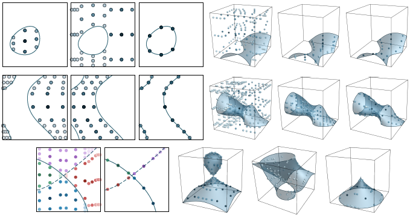

_Algoim_ is a collection of high-order accurate numerical methods and C++ algorithms for working with implicitly-defined geometry and level set methods. It includes:
- High-order accurate quadrature algorithms for computing integrals over implicitly-defined domains. Two different approaches are provided:
	* Quadrature methods for domains implicitly-defined by a single level set function (sufficiently-smooth, but otherwise arbitrary); and
	* Quadrature methods for multi-component domains implicitly-defined by multivariate polynomials, handling more complex geometry such as high curvature pieces, junctions, self-intersections, cusps, and boolean operations.
- High-order accurate algorithms for computing closest points on implicitly-defined surfaces, with application to high-order level set reinitialisation and extension velocity schemes.
- k-d trees optimised for codimension-one point clouds.

## Contents 
{:.no_toc}

* (auto-replaced by table of contents)
{:toc}

## Prerequisites

A C++ compiler supporting the C++17 standard or higher is required. In addition, if you want to use the quadrature algorithms for domains implicitly-defined by multivariate polynomials, a _LAPACKE_ implementation is required (or a suitable alternative, e.g., [Eigen](https://eigen.tuxfamily.org/index.php?title=Main_Page)); see the discussion below.

## Download

Clone via

```
git clone https://github.com/algoim/algoim.git
```

or visit the [Algoim GitHub page](https://github.com/algoim/algoim).

## Installation

Algoim is a header-only C++ library. Except for small example/demonstration applications, all of the files are C++ `.hpp` header files. As such, it requires minimal installation effort: simply download and configure so that the appropriate header driver can be found by your compiler when you include it in your C++ program, e.g., `#include "algoim/quadrature_general.hpp"`.

## High-Order Quadrature Algorithms for Implicitly-Defined Domains

An implicitly-defined domain is a volumetric region or codimension-one surface whose shape is defined implicitly by an isosurface of one or more scalar functions. A variety of applications require the evaluation of integrals over such domains, including level set methods for propagating interfaces in computational physics, cut-cell/embedded/immersed interface methods for solving partial differential equations, multi-mesh methods that use overlapping meshes of different characteristics, and in treating jump conditions and singular source terms in weak formulations. A specific example is that of [implicit mesh discontinuous Galerkin methods](https://doi.org/10.1016/j.jcp.2017.04.076), which have been developed to facilitate high-order accurate modelling of interfacial fluid dynamics.

To calculate integrals over implicitly-defined domains, a quadrature scheme must be computed. Algoim implements two kinds of quadrature algorithms:
- The first technique targets **general, sufficiently smooth level set functions**, based on the paper [R. I. Saye, _High-Order Quadrature Methods for Implicitly Defined Surfaces and Volumes in Hyperrectangles_, SIAM Journal on Scientific Computing, 37(2), A993-A1019 (2015)](http://dx.doi.org/10.1137/140966290).
- The second technique targets level set functions defined by **one or more multivariate polynomials**, based on the paper [R. I. Saye, _High-order quadrature on multi-component domains implicitly defined by multivariate polynomials_, Journal of Computational Physics, 448, 110720 (2022)](https://doi.org/10.1016/j.jcp.2021.110720).

Both techniques operate by reinterpreting the implicitly-defined geometry as the graph of an implicitly-defined (potentially multi-valued) height function, followed by a dimension-reduction approach along with one-dimensional quadrature. Both techniques construct quadrature schemes with positive weights and yield high-order accuracy; e.g., with 4 points per one-dimensional line integral, 8th order accuracy can be achieved (for sufficiently nice geometry).

The following table may help guide you in choosing between these two techniques.

| Implicitly-defined domain specified by a single, general level set function  | Implicitly-defined domain specified by (one or more) multivariate polynomials |
| --- | --- |
| Applicable to any level set function ϕ for which `Interval' arithmetic can be applied (roughly speaking, any function ϕ for which you can compute a first-order Taylor series and sufficiently bound the remainder; see below) | Applicable only to level set function(s) ϕ defined by multivariate polynomials, generally of small-to-medium degree |
| Works best when the implicitly-defined interface can be viewed as the graph of a well-defined, sufficiently smooth height function, e.g., no isolated droplets or sharp corners; applies heuristic subdivision methods whenever this is not the case | Can handle complex geometry, e.g., multi-component domains, high curvature pieces, tunnels, junctions, self-intersections, and cusps; subdivision methods are not needed |
| Assumes the domain is constrained by a user-defined hyperrectangle; simplex constraint cells can be used in 2D, but 3D requires care | Can be used on hyperrectangular and simplex constraint cells; in fact, any compact semi-algebraic set constraint domain is possible |
| On very smooth geometry, generally very fast, with optimal node counts; on very complex geometry, can result in large node counts | On small-to-medium degree polynomials, generally very fast, with small node counts (even for complex geometry); high-degree polynomials and/or high dimensions can be slower and more ill-conditioned |

Some examples illustrating the quadrature schemes are shown in the next two sections.

### Citing

If you make use of these quadrature algorithms in your work, in any documentation or publication please cite the appropriate paper. Doing so is a nice way to credit me (and my sponsors) for the time and resources it took to develop and publish this code.

### Quadrature algorithms for general, sufficiently smooth level set functions

<div style="width:502px; margin: 0 auto; font-size: 70%"><br/>Some examples illustrating the quadrature schemes constructed by the algorithm (based on a one-dimensional Gaussian quadrature scheme of node-count 4) for surface integrals (left column) and volume integrals (middle/right columns). The weights are coloured according to a scale that is normalised for each particular case: pale indicates a low-valued weight and dark blue indicates a high-valued weight.</div>

The driver header file for these quadrature algorithms is located at `algoim/quadrature_general.hpp`. There is only one driver routine, `quadGen` which is templated on the level set function object `phi` and the dimension `N`:

```cpp
template<int N, typename F>
algoim::QuadratureRule<N> algoim::quadGen(const F& phi, const algoim::HyperRectangle<real,N>& xrange, int dim, int side, int qo);
```

The parameters are as follows:
- `phi` is a user-defined function object which evaluates the level set function and its gradient. It must implement both `template<typename T> operator() (const algoim::uvector<T,N>& x) const` and `template<typename T> grad(const algoim::uvector<T,N>& x) const`. In the simplest case, `T = double` and the role of `phi` is to simply evaluate the level set function (e.g., `return x(0)*x(0) + x(1)*x(1) - 1;` for a unit circle) and its gradient (e.g., `return algoim::uvector<double,2>(2*x(0), 2*x(1));`). However, it is crucial that these two member functions be templated on `T` to enable the interval arithmetic algorithms. In essence, the interval arithmetic automatically computes a first-order Taylor series (with bounded remainder) of the given level set function, and uses that to make decisions concerning the existence of the interface and what direction to use when converting the implicitly-defined geometry into the graph of an implicitly-defined height function. This requirement on `phi` being able to correctly perform interval arithmetic places restrictions on the type of level set functions `quadGen` can be applied to; these restrictions are discussed later.
- `xrange` is a user-specified bounding box, indicating the extent of the `N`-dimensional constraint cell.
- `dim` is used to specify the type of quadrature:
    - If `dim < 0`, compute a **volumetric quadrature scheme**, whose domain is implicitly defined by `{phi < 0}` intersected with `xrange`.
    - If `dim == N`, compute a **curved surface quadrature scheme**, whose domain is implicitly defined by `{phi = 0}` intersected with `xrange`.
    - If `0 <= dim && dim < N`, compute a **flat surface quadrature scheme** for one of the sides of the hyperrectangle, i.e., for the domain `{phi < 0}`, intersected with `xrange`, intersected with the flat face `{x(dim) == xrange.side(side)(dim)}`.
- `side` is used only when `0 <= dim && dim < N` and specifies which side of the hyperrectangle to restrict to, either `side == 0` or `side == 1` for the "left" or "right" face, respectively (with normal pointing in the direction of the `dim`-th axis).
- `qo` specifies the degree of the underlying one-dimensional Gaussian quadrature scheme and must satisfy `1 <= qo && qo <= 100`. For example, `qo = 4` in the figure above.

The output of `quadGen` is an `algoim::QuadratureRule<N>` object. This object is essentially a `std::vector` listing the set of quadrature points (as `algoim::uvector<real,N>`) and their corresponding weights. A `QuadratureRule` object is also a functor -- its associated templated member function `operator()(const F& f)` can be applied to any user-specified integrand function to compute the result of applying the quadrature rule to a functional.

**Requirements on `phi`.** As mentioned above, the `phi` functor must be able to accept arguments of type `algoim::uvector<algoim::Interval<N>,N>`. Here, `algoim::Interval<N>` is a special type whose purpose is to calculate a first-order Taylor series with bounded remainder, and shares concepts in common with automatic differentiation (see the paper cited above for more details). `Interval<N>` implements `operator+`, `operator*`, `operator/`, etc., and can be used in a variety of ways, most commonly in evaluating simple algebraic expressions. Common unary operators are also implemented, e.g., `sin(Interval<N>)` and `exp(Interval<N>)`. However, one cannot straightforwardly apply `Interval<N>` arithmetic to max or min statements, `if` conditions, and other non-standard or non-smooth functions. When using Algoim quadrature schemes for the first time, it is recommended they be applied to smooth level set functions made out of polynomial expressions and common smooth functions like `sin`, `exp`, etc.

#### Examples

**All of these examples are implemented in `examples/examples_quad_general.cpp` in a single `main()` entry point; compile them with a C++17-compatible compiler of your choice.**

The quadrature algorithms of Algoim are here demonstrated with a level set function describing an ellipse (in `N = 2` dimensions) or ellipsoid (in `N = 3` dimensions). First, we define a function object implementing the level set function:

```cpp
template<int N>
struct Ellipsoid
{
    template<typename T>
    T operator() (const algoim::uvector<T,N>& x) const
    {
        if constexpr (N == 2)
            return x(0)*x(0) + 4.0*x(1)*x(1) - 1.0;
        else
            return x(0)*x(0) + 4.0*x(1)*x(1) + 9.0*x(2)*x(2) - 1.0;
    }

    template<typename T>
    algoim::uvector<T,N> grad(const algoim::uvector<T,N>& x) const
    {
        if constexpr (N == 2)
            return algoim::uvector<T,N>(2.0*x(0), 8.0*x(1));
        else
            return algoim::uvector<T,N>(2.0*x(0), 8.0*x(1), 18.0*x(2));
    }
};
```

To compute the area of the ellipse in 2D using a scheme with `qo = 4`, apply `quadGen` to a bounding box encapsulating the extent of the ellipse, and then apply the resulting quadrature rule to the integrand _f(x) = 1_:

```cpp
Ellipsoid<2> phi;
auto q = algoim::quadGen<2>(phi, algoim::HyperRectangle<double,2>(-1.1, 1.1), -1, -1, 4);
double area = q([](const auto& x) { return 1.0; });
// area ≈ 1.5708
```

To compute the volume of the ellipsoid in 3D, simply change `N`:

```cpp
Ellipsoid<3> phi;
auto q = algoim::quadGen<3>(phi, algoim::HyperRectangle<double,3>(-1.1, 1.1), -1, -1, 4);
double volume = q([](const auto& x) { return 1.0; });
// volume ≈ 0.69813
```

Each of the two examples above relied on the quadrature scheme's ability to automatically subdivide the given bounding box until the interface geometry can be represented as the graph of a well-defined, single-valued height function. The subdivision routine terminates as soon as an internal criterion is met (discussed more in the paper cited above). An alternative method revealing asymptotic high-order accuracy (under h-refinement) is to subdivide the ellipsoid via a Cartesian grid and apply `quadGen` to individual grid cells, as follows:

```cpp
int n = 16;
double dx = 2.2 / n;
Ellipsoid<2> phi;
double area = 0.0;
for (int i = 0; i < n; ++i) for (int j = 0; j < n; ++j)
{
    algoim::uvector<double,2> xmin{-1.1 + i*dx, -1.1 + j*dx};
    algoim::uvector<double,2> xmax = xmin + dx;
    area += algoim::quadGen<2>(phi, algoim::HyperRectangle<double,2>(xmin, xmax), -1, -1, 4).sumWeights();
}
// area ≈ 1.570796327
```

To compute the measure of an implicitly-defined codimension-one surface, change the `dim` parameter to equal `N`:

```cpp
Ellipsoid<3> phi;
auto q = algoim::quadGen<3>(phi, algoim::HyperRectangle<double,3>(-1.1, 1.1), 3, -1, 4);
double surface_area = q.sumWeights();
// surface_area ≈ 4.4007
```

To visualise a quadrature scheme produced by `algoim::quadGen`, one possibility is to use the tool provided in `algoim/quadrature_general.hpp`. This method outputs a scheme in the format of an XML VTK `.vtp` file, which you can open with, e.g., [ParaView](https://www.paraview.org/). The routine takes as input a user-defined stream (e.g., a `std::ofstream`) and writes XML to the stream, interpreting the quadrature scheme as a scattered set of points with associated weights:

```cpp
#include <fstream>
...
algoim::QuadratureRule<N> q = ...;
std::ofstream f("scheme.vtp");
algoim::outputQuadratureRuleAsVtpXML(q, f);
// Open 'scheme.vtp' in ParaView
```

#### Citing

If you make use of these quadrature algorithms in your work, in any documentation or publication please cite the following paper. Doing so is a nice way to credit me (and my sponsors) for the time and resources it took to develop and publish this code.
- [R. I. Saye, _High-Order Quadrature Methods for Implicitly Defined Surfaces and Volumes in Hyperrectangles_, SIAM Journal on Scientific Computing, 37(2), A993-A1019 (2015)](http://dx.doi.org/10.1137/140966290)

### Quadrature algorithms for domains implicitly-defined by multivariate polynomials

<div style="width:679px; margin: 0 auto; font-size: 70%"><br/>Some examples illustrating the quadrature schemes constructed by the algorithm (based on a one-dimensional Gaussian quadrature scheme of node-count 3). Each of the four examples in the top two rows illustrate the quadrature scheme for the inside, outside, and surface. The bottom-left example illustrates a case of two intersecting polynomials with a junction; the quadrature scheme is high-order accurate on each component, indicated by the colours. The bottom-right examples illustrate 3D cases with singularities, such as cusps and self-intersections.</div>

The driver header file for these quadrature algorithms is located at `algoim/quadrature_multipoly.hpp` and some examples are given in `examples/examples_quad_multipoly.cpp`. These methods are templated on the dimension `N', and `algoim::ImplicitPolyQuadrature<N>` implements the core driver. To build a quadrature scheme, there are essentially three steps:
1. Instantiate a multivariate Bernstein polynomial, one for each level set function. In Algoim, these are implemented tensor-product Bernstein polynomials whose coefficients are stored in N-dimensional arrays of extent (P_0, P_1, ..., P_{N-1}). These arrays are manipulated via `algoim::xarray` objects (representing a view to a contiguous block of P_0*...*P_{N-1} `real`s), and the header file `algoim/bernstein.hpp` implements several routines for manipulating Bernstein polynomials. One of the simplest approaches to instantiate an `N`-dimensional Bernstein polynomial is to use the `algoim::bernstein::bernsteinInterpolate<N>`` method, which outputs the unique polynomial interpolating the given functor at the nodes of a Chebyshev-based tensor-product grid.
2. Next, create an `algoim::ImplicitPolyQuadrature<N>' object with the above Bernstein polynomials as input parameters. The creation of the `ImplicitPolyQuadrature' object implements the hierarchical construction phase of the quadrature algorithm: in essence, a height direction is automatically chosen and the implicitly-defined integral is recast as a base integral (in one fewer dimensions) applied to a one-dimensional integrand, continuing recursively down to the `N = 1` base case. For details, see [the paper](https://doi.org/10.1016/j.jcp.2021.110720).
3. After building the hierarchy, call `integrate` (for volumetric integrals) or `integrate_surf` (for surface integrals) on the `ImplicitPolyQuadrature` object, with parameters specifying the one-dimensional node count _q_ and the integrand _f_. The latter is a function object implementing `operator()(const algoim::uvector<real,N>& x, real w)` and takes the quadrature node and weight as input. For example, _f_ can be used to record the given quadrature points, e.g., for repeated usage in a finite element method, or for visualisation purposes.

#### Examples

As a simple example, suppose you wanted to build a quadrature scheme for a 3D ellipsoid. First, define a functor which returns the level set function value:

```cpp
auto ellipsoid = [](const uvector<real,3>& x)
{
    return x(0)*x(0) + x(1)*x(1)*4 + x(2)*x(2)*9 - 1;
};
```

Second, set aside some memory to store the coefficient values of a tensor-product Bernstein polynomial, which in this case would be a triquadratic polynomial require 27 scalar values:

```cpp
real data[27]; // or some other memory block elsewhere, on the stack, heap, etc.
xarray<real,3> phi(data, uvector<int,3>(3,3,3)); // (3,3,3) indicates the array extent, equal to the Bernstein degree plus one
```

Third, build the Bernstein coefficients corresponding to the ellipsoid level set function. There are many ways to do this, e.g., converting the coefficients in a monomial basis to the Bernstein basis, or solving an interpolation problem. In many circumstances, the interpolation method provided in `algoim/bernstein.hpp` is a convenient approach:

```cpp
bernstein::bernsteinInterpolate<N>([&](const uvector<real,N>& x) { return ellipsoid(xmin + x * (xmax - xmin)); }, phi);
```

The coordinate system of `bernstein::bernsteinInterpolate` is relative to the unit cube [0,1]^N; these coordinates are then mapped to custom domain [xmin,xmax] when evaluating the ellipsoid functor. Having built the input Bernstein polynomial, we can then build the quadrature hierarchy:

```cpp
ImplicitPolyQuadrature<3> ipquad(phi);
```

and then build a volumetric quadrature scheme as follows:

```cpp
int q = 3; // q nodes per one-dimensional line integral
std::vector<uvector<real,N>> phase0, phase1; // stores quadrature nodes for the 'inside' and 'outside'
ipquad.integrate(AutoMixed, q, [&](const uvector<real,N>& x, real w)
{
    if (bernstein::evalBernsteinPoly(phi, x) < 0)
	    phase0.push_back(x);
    else
        phase1.push_back(x);
});
```

In the above code, the `integrate` method is given a lambda which records the quadrature point in the vectors `phase0` and `phase1`, depending on whether the quadrature point is inside or outside the ellipsoid, respectively. Meanwhile, the `AutoMixed` parameter controls the quadrature strategy; see the in-depth discussion of [the paper](https://doi.org/10.1016/j.jcp.2021.110720) as well as the comments given in `algoim/quadrature_multipoly.hpp`.

#### Additional examples 

Additional examples are given in `examples/examples_quad_multiply.cpp` in a single `main()` entry point; compile them with a C++17-compatible compiler of your choice. The examples include:
- q-convergence tests, examining the error as the quadrature node count increases,
- replication of some of the examples shown in [the paper](https://doi.org/10.1016/j.jcp.2021.110720).

#### Citing

If you make use of these quadrature algorithms in your work, in any documentation or publication please cite the following paper. Doing so is a nice way to credit me (and my sponsors) for the time and resources it took to develop and publish this code.
- [R. I. Saye, _High-order quadrature on multi-component domains implicitly defined by multivariate polynomials_, Journal of Computational Physics, 448, 110720 (2022)](https://doi.org/10.1016/j.jcp.2021.110720).

## High-Order Algorithms for Computing Closest Points on Implicitly-Defined Surfaces

A powerful technique for representing curves in two dimensions (`N = 2`) and surfaces in three dimension (`N = 3`) is to define them implicitly as a level set of a continuous, `N`-dimensional scalar function. This technique of embedding the surface geometry in a higher-dimensional function (which is often called the "level set function") leads to a wide array of mathematical and computational advantages, as exemplified by the [level set method](http://en.wikipedia.org/wiki/Level_set_method) for moving interface problems, and the [Voronoi implicit interface method](http://dx.doi.org/10.1073/pnas.1111557108) for computing multiphase interface evolution.

Numerical methods making use of this idea often require accurate approximations of nearest points on implicitly-defined surfaces. High-order accurate algorithms for this purpose are described in the paper [R. I. Saye, _High-order methods for computing distances to implicitly defined surfaces_, Communications in Applied Mathematics and Computational Science, 9(1), 107-141 (2014)](http://dx.doi.org/10.2140/camcos.2014.9.107).

Provided in Algoim is C++ code implementing the algorithms developed in the paper. These algorithms can be used to implement, for example, high-order accurate reinitialisation/redistancing algorithms in level set methods. The code mainly applies to the case that the level set function is defined on a rectangular Cartesian grid. However, as discussed in the paper, it is possible to extend the algorithms to the case of unstructured grids - one could use the code as a starting point. For example, the implementations of the k-d tree and Newton's method could be used as-is without modification in such an adaptation.

<div style="width:521px; margin: 0 auto; font-size: 70%"><br/>Reinitialising a two-dimensional level set function. (left) Contour plot of a function which implicitly defines an elliptical interface (black curve). (right) Contour plot of the corresponding reinitialised signed distance function.<br/>&nbsp;<br/></div>

<div style="width:400px; margin: 0 auto; font-size: 70%"><br/>Level sets of a signed distance function reconstructed from the surface shown in grey. This example was constructed from a small 5 by 5 by 5 patch of grid cells, in such a way that the droplet on the right is completely contained within one grid cell. Subgrid details such as this are important in high-order methods involving implicitly-defined geometry.</div>

### Citing

If you make use of these high-order closest point algorithms in your research, in any documentation or publication please cite the following paper. Doing so is a nice way to credit me (and my sponsors) for the time and resources it took to develop and publish this code.
- [R. I. Saye, _High-order methods for computing distances to implicitly defined surfaces_, Communications in Applied Mathematics and Computational Science, 9(1), 107-141 (2014)](http://dx.doi.org/10.2140/camcos.2014.9.107)

### Usage

The high-order closest point algorithms are located in a number of header files:
- `algoim/newtoncp.hpp`: Newton's method for the constrained minimum-distance optimisation problem applied to finding closest points on the zero level set of a function (typically a polynomial).
- `algoim/stencilpoly.hpp`: Implements the stencil-based polynomial interpolation algorithms for 10 different classes of polynomial in 2D and 3D, including bicubic and tricubic interpolants.
- `algoim/kdtree.hpp`: Implements a k-d tree data structure for a given collection of points in `R`<sup>`N`</sup>. This particular k-d tree has been optimised for clouds of points that originate from smooth codimension-one surfaces using coordinate transformations that result in "tight" bounding boxes for nodes in the tree. More details are provided [below](#k-d-trees-optimised-for-codimension-one-point-clouds).
- `algoim/hocp.hpp`: Main driver routines for the high-order closest point algorithm applied to rectangular Cartesian grids.

A typical framework using these algorithms operates in two steps. First, in a setup phase, a `algoim::KDTree` is created based on a cloud of seed points approximately sampling the interface. Second, for a closest point query given a point `x`, the closest seed point to `x` is found using the `algoim::KDTree` and this approximation is then "polished" using Newton's method (`algoim::newtonCP`) applied to piecewise polynomial interpolants of the level set function (`algoim::StencilPoly<N,Degree>` or equivalent). 

### Examples

These ideas are demonstrated in two example programs. **Each `cpp` file contains a single `main()` entry point; compile them (individually) with a C++17 compatible compiler of your choice.**
- `examples/examples_hocp_simple.cpp`: The code demonstrates a very simple problem of reinitialising a level set function in 2D and 3D. Type in a dimension (2 or 3) and the number of grid points in each axis to have the program reinitialise a spherical interface level set function and report the maximum-norm error of the computed signed distance function.
- `examples/examples_hocp_convergence.cpp`: This program implements a series of convergence tests on different interface geometries and can be used to replicate the results in the above cited paper. Use it by specifying the test problem via command-line parameters – for example, `./examples_hocp_convergence 2 sphere` or `./examples_hocp_convergence 3 ellipsoid`.

## k-d Trees Optimised for Codimension-One Point Clouds

[k-d trees](https://en.wikipedia.org/wiki/K-d_tree) are one of the most effective data structures for finding the closest point in a cloud of scattered points (i.e., a nearest-neighbour search). In its standard form, a k-d tree recursively subdivides the cloud of points along alternating axes. If the point data is situated on or near a smooth codimension-one surface (e.g., a sphere in 3D), the performance of a k-d tree can be further optimised by using approximations of the surface tangent hyperplane. This idea is further detailed in the paper [R. I. Saye, _High-order methods for computing distances to implicitly defined surfaces_, Communications in Applied Mathematics and Computational Science, 9(1), 107-141 (2014)](http://dx.doi.org/10.2140/camcos.2014.9.107) and an implementation of the resulting k-d tree optimised for codimension-one point clouds is given in Algoim's `algoim/kdtree.hpp`.

An example of its usage is as follows.

```cpp
#include "algoim/kdtree.hpp"
...
// Generate a random set of points on the surface of a sphere
std::vector<uvector<double,3>> pts;
for (int i = 0; i < 1000; ++i)
{
    uvector<double,3> x(rand(), rand(), rand());
    pts.push_back(x / norm(x));
}
// Build a kdtree of the point cloud
algoim::KDTree<double,3> tree(pts);
// Find the closest point to some query point y
uvector<double,3> y(rand(), rand(), rand());
y /= norm(y);
int ind = tree.nearest(y);
// The closest point is then pts[ind]
```

## Advanced: High-Precision Arithmetic

By default, Algoim is configured to use `double`-precision arithmetic. For high precision applications of the associated high-order accurate algorithms, Algoim can interface to a user-defined high-precision scalar type, by redefining the `algoim::real` typedef in `algoim/real.hpp`. One possibility is to use the open-source [QD library](https://www.davidhbailey.com/dhbsoftware/) which implements software-driven double-double and quadruple-double arithmetic.

To make use of high-precision arithmetic in Algoim, a few modifications may be needed, depending on what part of Algoim is being used:
- Some of the embedded/precomputed numbers may need to be updated. For example, the precomputed Gaussian quadrature schemes in `algoim/gaussquad.hpp', which have about 20 digits of accuracy, would need updating for double-double or quadruple-double accuracy. (I can provide this data to 75 digits of accuracy upon request.)
- Regarding the quadrature algorithms for domains implicitly-defined by polynomials, the standard code in Algoim assumes a LAPACKE implementation is available. _LAPACK_ is used for just two purposes: (i) computing SVD factorisations and (ii) solving generalised eigenvalue problems. These methods would need to be replaced with ones supporting high-precision arithmetic. One possibility is to use [Eigen](https://eigen.tuxfamily.org/index.php?title=Main_Page). Unmodified, _QD_ is incompatible with _Eigen_ (because of ambiguous overloads when an integer is assigned to a `dd_real` or `qd_real` object); however it is relatively straightforward to patch _QD_ so that it can work with _Eigen_. Besides _QD_ there are several other possibilities for high-precision arithmetic as well.

## About

_Algoim_ was developed by [Robert Saye](http://math.lbl.gov/~saye/) in the [Mathematics Group](http://math.lbl.gov) at the [Lawrence Berkeley National Laboratory](https://www.lbl.gov/) as part of his research in numerical methods for high-order accurate interface dynamics with applications in multi-phase multi-physics. For more information and applications of these algorithms, visit [his research page](http://math.lbl.gov/~saye/).

This work was supported in part by the U.S. Department of Energy (DOE), Office of Science, Office of Advanced Scientific Computing Research (ASCR) Applied Mathematics Program, by a DOE Office of Science Early Career Research Program award, and by the DOE ASCR Scientific Discovery through Advanced Computing (SciDAC) FASTMath program, all under Contract No. DE-AC02-05CH11231 at Lawrence Berkeley National Laboratory.
